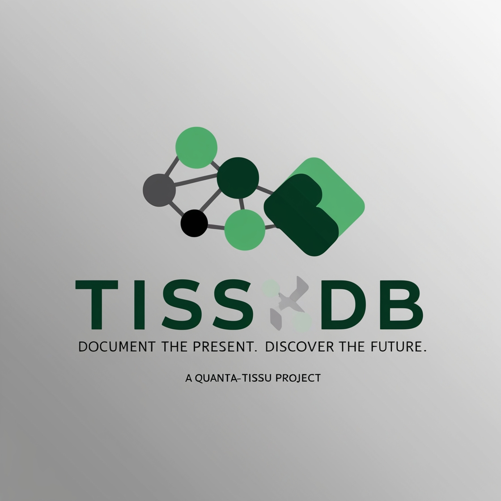

# The QuantaTissu Ecosystem

Welcome to the QuantaTissu Ecosystem, a multi-faceted platform for next-generation AI and data management. This project integrates a from-scratch language model, a high-performance database, agentic tooling, and advanced analytics into a single, cohesive environment. It is designed for developers, researchers, and pioneers interested in building and experimenting with cutting-edge, resource-conscious AI systems.

## Core Components

The ecosystem is comprised of several key components, each designed to be powerful on its own and even more capable when used together.

---

### 1. QuantaTissu: The Agentic Language Model

**QuantaTissu** is a sophisticated, transformer-based language model built from scratch in Python with NumPy. Originally an educational tool, it has evolved into a capable Retrieval-Augmented Generation (RAG) system designed for agentic tasks.

**Key Features:**
*   **Complete Transformer Architecture:** Implements all core components, including embeddings, positional encoding, multi-head self-attention, and feed-forward networks.
*   **Retrieval-Augmented Generation (RAG):** Features a built-in vector knowledge base that allows the model to retrieve relevant information and use it to generate more accurate and contextually-aware responses.
*   **Self-Updating Knowledge Base:** The knowledge base can learn from interactions, user feedback, and its own successful outputs, continuously improving its performance over time.
*   **Advanced Inference Strategies:** Supports multiple sampling methods, including greedy decoding, top-k, and nucleus (top-p) sampling.
*   **Full Training Pipeline:** Includes a from-scratch implementation of backpropagation, an Adam optimizer, and a configurable training loop.

---

### 2. TissDB: High-Performance C++ NoSQL Database

**TissDB** is a lightweight, high-performance NoSQL database built entirely in C++. It serves as the primary persistence layer for the QuantaTissu ecosystem.

**Key Features:**
*   **LSM-Tree Storage Engine:** Optimized for high write throughput, making it suitable for logging, time-series data, and other write-intensive applications.
*   **JSON-like Document Model:** Offers a flexible, schema-less data model.
*   **TissQL Query Language:** A simple, SQL-like interface for data manipulation and retrieval.
*   **RESTful API:** Provides a straightforward HTTP-based API for interacting with the database from any language.
*   **Write-Ahead Log (WAL):** Ensures data durability and allows for state recovery on restart.

**Current Status:** TissDB is functional and in active development. Current limitations include in-memory primary data structures and non-persistent indexes, which are targets for future enhancement.

---

### 3. Nexus Flow: Graph Visualization & Analysis

**Nexus Flow** is a C++ application for visualizing and interacting with complex graph structures. It is designed to be the primary interface for exploring relationships in data and AI-generated knowledge graphs.

**Key Features:**
*   **Interactive 3D Visualization:** Render and manipulate graphs in a 3D space.
*   **LLM Integration (Planned):** Undergoing development to integrate tightly with **TissLM**, enabling users to generate and modify graphs using natural language prompts.
*   **TissDB Integration (Planned):** Future versions will use **TissDB** as a persistence layer to save, load, and query graph structures.
*   **Native Analytics Suite (Planned):** A high-performance graph analytics library is being developed to run directly within the C++ application.

---

### 4. Analytics Platform

The ecosystem includes a Python-based analytics platform designed for complex data analysis and modeling.

**Key Features:**
*   **Database Connectivity:** Includes a dedicated connector (`db_connector.py`) to interface with data sources like TissDB.
*   **Charting and Visualization:** Contains modules for generating charts and other data visualizations (`charting.py`).
*   **Financial Modeling:** Features a `trading_engine.py` component, suggesting capabilities for financial analysis and algorithmic trading simulations.
*   **Extensible Architecture:** Designed to be modular, allowing for the addition of new analytical tools and patterns.

---

### 5. TissLang: The Agentic Language

**TissLang** is a high-level, declarative language designed to orchestrate agentic workflows. It provides a structured, human-readable syntax for defining complex tasks that the QuantaTissu agent can execute.

**Core Concepts:**
*   **`TASK` & `STEP`**: Define the overall objective and break it into logical units.
*   **Commands**: Execute actions like `WRITE` to the file system or `RUN` a shell command.
*   **`ASSERT`**: Verify the outcomes of commands to ensure the workflow is proceeding correctly.

**Example:**
```tiss
#TISS! Language=Python

TASK "Create and test a simple Python script"

STEP "Create the file" {
    WRITE "main.py" <<PYTHON
print("Hello, QuantaTissu!")
PYTHON
}

STEP "Run and verify" {
    RUN "python main.py"
    ASSERT LAST_RUN.EXIT_CODE == 0
    ASSERT LAST_RUN.STDOUT CONTAINS "Hello, QuantaTissu!"
}
```

---

### 6. Tissu Sinew: C++ Connector for TissDB

**Tissu Sinew** is a lightweight, high-performance C++ connector providing a native interface to TissDB. It is the backbone for communication between C++ components (like **Nexus Flow**) and the database.

**Key Features:**
*   **Thread-Safe Client:** Manages a connection pool for efficient, multi-threaded access.
*   **Modern C++ API:** Uses RAII, smart pointers, and exception-based error handling for robust and clean code.
*   **High Performance:** Designed for low-overhead communication with the TissDB server.

## Project Philosophy

*   **Ecological Awareness:** We aim to build AI systems that are not only powerful but also resource-efficient, from model architecture to code generation.
*   **From-Scratch Implementation:** Core components are built from the ground up to ensure a deep understanding of the underlying technology and to maintain full control over the stack.
*   **Agentic Computing:** Our ultimate goal is to create autonomous agents that can reason, plan, and execute complex tasks in a development environment.

## Getting Started

Usage instructions for each component can be found in their respective directories and documentation files. For a quick start:

*   **To train the Python LLM:** `python quanta_tissu/tisslm/legacylm/train.py`
*   **To run TissDB:** `make && ./tissdb` (from within the `tissdb` directory)
