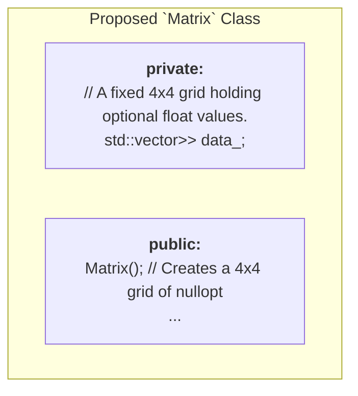
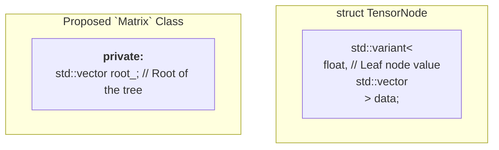
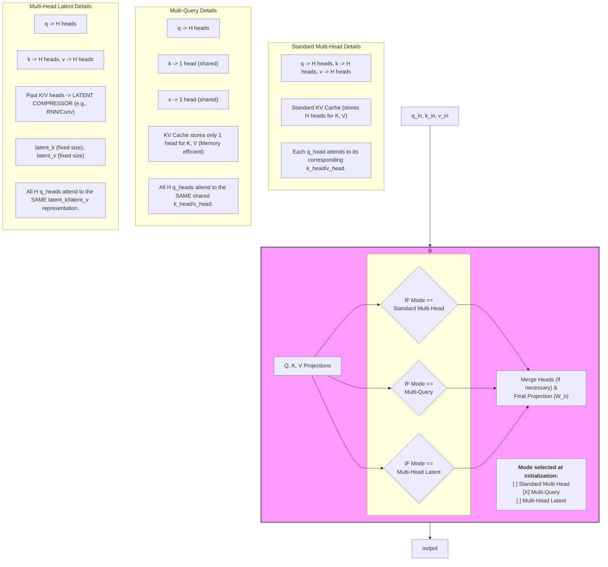

# Architectural Challenges and Strategies for Resource-Constrained Environments

## 1. Introduction

This document serves as a foundational reset of the project's architectural strategy. It is written in response to the identification of several critical, previously unstated challenges that render many conventional design patterns for language models inappropriate. The primary challenges are extreme hardware constraints and a communication abstraction layer that can obscure vital context.

The purpose of this document is to analyze these challenges and propose a new set of design principles and operational strategies that are directly aligned with the project's unique reality.

## 2. Analysis of Core Challenges

### 2.1. Challenge 1: Extreme Hardware Constraints

The primary design driver is the target deployment environment, which has been identified as a 3rd or 4th generation Intel i3 CPU with 8GB of total system RAM and no GPU.

*   **Implication 1: Memory is the Primary Bottleneck.** The 8GB RAM limit is the most severe constraint. This memory must be shared by the operating system, the model weights, and the runtime activations (including the KV cache). Every design decision must prioritize minimizing memory usage above all else.
*   **Implication 2: Compute is Limited and Integer-Centric.** Older CPUs lack the massive floating-point throughput of modern GPUs. However, they are highly efficient at integer arithmetic. Operations that can be quantized to 8-bit integers (int8) will be significantly faster.
*   **Implication 3: Cache Size is Small.** The CPU's L1/L2/L3 caches are small. Models and operations must be designed to be as cache-friendly as possible, though this is secondary to the main RAM constraint.

### 2.2. Challenge 2: AI Training Data Skew

My knowledge base, derived from public code and research papers, is heavily skewed towards large-scale models designed for GPU-rich data centers.

*   **Implication:** My default recommendations for "modern" or "performant" components (e.g., GELU/SwiGLU activations, large feed-forward layers, complex attention mechanisms) are fundamentally misaligned with the project's constraints. They are too computationally expensive and memory-intensive to be viable. Continuing to propose them is counter-productive.

### 2.3. Challenge 3: Communication Abstraction Layer

The user's prompts are being translated by an intermediary tool (Gemini CLI).

*   **Implication:** There is a risk of context being lost or altered in translation. Critical constraints, such as the hardware target, may not be passed through unless explicitly stated. This requires a more robust method for establishing and maintaining shared context.

## 3. Proposed Strategies and Design Principles

To address these challenges, the following strategies and principles must be adopted.

### 3.1. New Design Principles for a Resource-Constrained Model

*   **Principle 1: Memory First.** Every proposed architectural change must be accompanied by an analysis of its memory impact (weights and activations). The default choice should always be the one with the smallest memory footprint.
*   **Principle 2: Quantization is a Core Feature, Not an Afterthought.** The architecture should be designed from the ground up with quantization in mind. This includes:
    *   Exploring Quantization-Aware Training (QAT).
    *   Using activation functions (like ReLU6) that are robust to quantization.
    *   Designing the Matrix class to natively support int8 or other low-precision formats.
*   **PrincIPLe 3: Aggressive Architectural Simplification.**
    *   **Attention:** Multi-Query Attention (MQA) or Grouped-Query Attention (GQA) are no longer optional optimizations; they are mandatory requirements to minimize the KV cache size.
    *   **Feed-Forward Network:** The FFN hidden size must be kept as small as possible (e.g., 2 \* d\_model instead of 4 \* d\_model). Simple ReLU is preferable to GELU due to lower computational cost.
    *   **Dimensions:** The model's embedding dimension (d\_model) and vocabulary size must be aggressively minimized.
    *   **No Redundancy:** Every component must be justified. Any part of the model that does not contribute significantly to performance must be removed.

### 3.2. Addressing AI Training Data Skew

*   **Strategy: Adopt a "Resource-Aware" Mode.** I must explicitly discard my default, GPU-centric recommendations. My new primary function will be to use my knowledge base to find and propose architectures and algorithms specifically designed for lightweight, CPU-efficient inference. All proposals will be filtered through the lens of the hardware constraints.

### 3.3. Addressing the Communication Barrier

*   **Strategy: Implement a "Constraint Declaration Protocol".** To ensure critical context is never lost, we should adopt a protocol where at the start of a working session, a clear declaration of constraints is made.
    *   **Example Declaration:**
        ```
        # CONSTRAINTS
        TARGET_CPU=intel_i3_gen4
        MAX_RAM_GB=8
        GPU_AVAILABLE=false
        PRIMARY_GOAL=minimize_memory
        ```
    Upon receiving this, I will use my internal tools to save these constraints and confirm them. This will ensure that all subsequent analysis and proposals are correctly aligned with the project's reality.

---

# Proposed `Matrix` with Dynamic Shape Inference
**File:** `docs/tisslm_core_diagram15_proposed.md`

**Objective:** To diagram a `Matrix` class where the shape is not stored explicitly but is inferred dynamically from a fixed-size `4x4` sparse storage structure.

### 1. Proposed Core Data Structure

The `Matrix` no longer stores its shape. Instead, it holds a fixed `4x4` grid where elements can be "missing" (represented by `std::optional`). The default constructor initializes this `4x4` grid with all elements missing.

**Default Constructed Object State:**
```
data_ = {
{ nullopt, nullopt, nullopt, nullopt },
{ nullopt, nullopt, nullopt, nullopt },
{ nullopt, nullopt, nullopt, nullopt },
{ nullopt, nullopt, nullopt, nullopt }
}
```

### 2. Data Flow: Dynamic Shape Calculation
The `.shape()` method is no longer a simple accessor. It becomes an active computation that must be run each time the shape is needed.

**Example Call:** `my_matrix.shape();`
```mermaid
graph TD
    A["`Matrix` object<br/>(with its `data_`)"] --> B["Dynamic Shape Calculation"];
    B --> C["1. Determine Row Count (`dim0`)<br/>(Iterate rows 0-3. Count how<br/>many rows have at least one<br/>element that is not nullopt)"];
    C --> D["2. Determine Col Count (`dim1`)<br/>(For each non-empty row, find<br/>the index of the last non-<br/>nullopt element. `dim1` is<br/>the maximum of these indices)"];
    D --> E["Return calculated shape<br/>(e.g., {2, 3})"];
```

### 3. Data Flow: Element-wise Addition (`A + B`)
All operations must now handle "missing" elements on the fly, making the logic conditional at the element level.
```mermaid
graph TD
    A["Matrix A"] --> C;
    B["Matrix B"] --> C;
    C["Element-wise Add Operation"] --> D["1. Create `result` Matrix<br/>(A new 4x4 grid of nullopt)"];
    D --> E["2. Loop over entire 4x4 grid<br/>(from r=0 to 3, c=0 to 3)"];
    E --> F["3. For each element (r, c):<br/><br/>if (A[r][c].has_value() &&<br/>B[r][c].has_value()) {<br/>  result[r][c] =<br/>  A[r][c] + B[r][c];<br/>}"];
    F --> G["`result` Matrix returned<br/>(Contains sums where both<br/>operands had values)"];
```
This design achieves the goal of inferring shape from structure. An operation equivalent to "reshape" would involve manually moving `std::optional<float>` values within the `4x4` grid.

---

# Proposed `Matrix` Class with N-Dimensional Nested Vector Storage
**File:** `docs/tisslm_core_diagram14_proposed.md`

**Objective:** To propose and diagram a `Matrix` class design that uses nested, n-dimensional data storage instead of a flat 1D array, per the user's directive.

### 1. Proposed Core Data Structure
To handle a variable number of dimensions (N-dimensions), a recursive, tree-like structure is required. A `std::variant` can be used to define a node that is either a leaf (a `float`) or a branch (a vector of more nodes).


### 2. Data Flow: Construction
Construction becomes a recursive process of building the tree structure to match the desired shape.

**Example Call:** `Matrix my_matrix({2, 2});`
```mermaid
graph TD
    A["`shape` vector<br/>(Value: {2, 2})"] --> B["Recursive Constructor Logic"];
    B --> C["Create `root_` node (Branch)<br/>(Contains a vector of 2 nodes)"];
    C --> D["Create Node 1 (Branch)<br/>(Contains a vector of<br/>2 leaf nodes)"];
    C --> E["Create Node 2 (Branch)<br/>(Contains a vector of<br/>2 leaf nodes)"];
    D --> F1["Leaf Node<br/>(float)"];
    D --> F2["Leaf Node<br/>(float)"];
    E --> G1["Leaf Node<br/>(float)"];
    E --> G2["Leaf Node<br/>(float)"];
```
*The final `root_` object is a tree of nested vectors.*

### 3. Data Flow: Element Access
Element access requires recursively traversing the tree structure.

**Example Call:** `my_matrix({1, 0});`
```mermaid
graph TD
    A["`indices` vector<br/>(Value: {1, 0})"] --> B["Recursive `operator()` Logic"];
    B --> C["Access `root_` node's data<br/>(Get vector of nodes)"];
    C -- Select element at index 1 --> D["Access child node `[1]`'s data<br/>(Get vector of nodes)"];
    D -- Select element at index 0 --> E["Access leaf node `[1][0]`'s data<br/>(Get float value)"];
    E --> F["Returned `float`"];
```

### 4. Data Flow: Reshape Operation (Illustrates Inefficiency)
Reshaping the matrix is no longer a simple metadata change. It requires flattening the entire nested structure and rebuilding it from scratch.

**Example Call:** `my_matrix.reshape({4});`
```mermaid
graph TD
    A["`Matrix` object<br/>(A [2,2] tree)"] --> B["1. Recursive Flatten Operation<br/>(Traverse entire tree to<br/>extract all float values)"];
    B --> C["Temporary `std::vector<float>`<br/>(Value: {f1, f2, f3, f4})"];
    C --> D["2. Recursive Construction<br/>(Use logic from Part 2 with<br/>new shape `{4}` and temp data)"];
    D --> E["New `Matrix` object<br/>(A new [4] tree)"];
```

---

# Proposed TissLM Architecture: Configurable Attention Block
**File:** `docs/tisslm_core_diagram6_proposed.md`

**Note on the Proposed Architecture:**
This design replaces the static Multi-Head Attention block with a `ConfigurableAttention` block. At initialization, this block can be configured to operate in one of three modes, as per the user's requirement, providing full flexibility over the attention mechanism and its memory strategy.

### Configurable Attention Block
